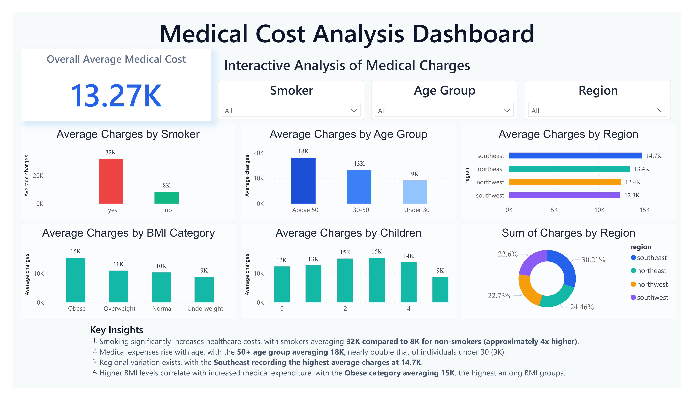

# 🏥 Medical Cost Analysis Project

## 📌 Project Overview
This is an end-to-end Data Analysis project focused on analyzing medical insurance charges using SQL, Python (Jupyter Notebook), and Power BI.

The objective is to identify key factors that influence medical costs such as smoking habits, age, BMI, region, and number of children.

---

## 🛠 Tools & Technologies Used
- SQL (Data Extraction & Aggregation)
- Python (Pandas, Matplotlib)
- Jupyter Notebook
- Power BI (Dashboard Visualization)

---

## 📊 Key Insights

1. Smokers incur significantly higher medical charges compared to non-smokers.
2. Individuals above 50 years have the highest average medical expenses.
3. Higher BMI categories (especially Obese) are associated with increased charges.
4. The Southeast region shows the highest average medical costs.
5. Medical charges tend to increase up to 3 children and decrease afterward.

---

## 📂 Project Files
- `Medical.ipynb` → Python analysis and visualizations  
- `Sql query.sql` → SQL queries used for aggregation  
- `Medical_cost.png` → Power BI dashboard snapshot  

---

## 📈 Dashboard Preview

---

## 🎯 Conclusion
Smoking, age, and BMI are the strongest drivers of medical insurance charges. This analysis demonstrates data cleaning, SQL aggregation, visualization, and dashboard development skills.

---

## 👨‍💻 Author
Ananya Varshney
